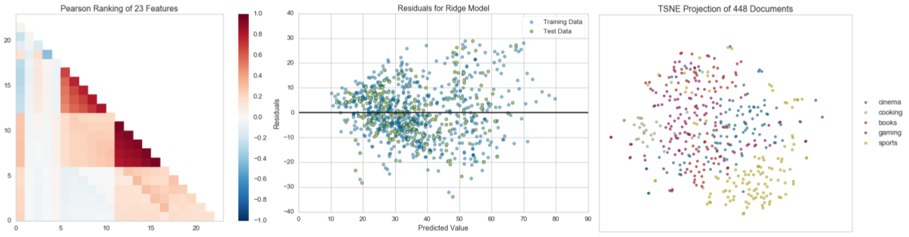

# Yellowbrick

[](https://travis-ci.org/DistrictDataLabs/yellowbrick)
[](https://coveralls.io/github/DistrictDataLabs/yellowbrick?branch=master)
[](https://landscape.io/github/DistrictDataLabs/yellowbrick/master)
[](http://yellowbrick.readthedocs.io/en/latest/?badge=latest)
[](https://waffle.io/DistrictDataLabs/yellowbrick)


**帮助选择机器学习模型的可视化分析和诊断工具**


Image by [Quatro Cinco](https://flic.kr/p/2Yj9mj), 经许可使用, Flickr Creative Commons.

这个README是针对开发者的指南，如果你对Yellowbrick感兴趣，请查看我们的[文档](http://www.scikit-yb.org/).

## 什么是Yellowbrick?

Yellowbrick是由一套被称为"Visualizers"组成的可视化诊断工具组成的套餐，其由Scikit-Learn API延伸而来，对模型选择过程起指导作用。总之，Yellowbrick结合了Scikit-Learn和Matplotlib并且最好得传承了Scikit-Learn文档，对 _你的_ 模型进行可视化！



### Visualizers

Visualizers也是estimators（从数据中习得的对象），其主要任务是产生可对模型选择过程有更深入了解的视图。从Scikit-Learn来看，当可视化数据空间或者封装一个模型estimator时，其和转换器（transformers）相似，就像"ModelCV" (比如 RidgeCV, LassoCV)的工作原理一样。Yellowbrick的主要目标是创建一个和Scikit-Learn类似的有意义的API。其中最受欢迎的visualizers包括：

#### 特征可视化

- **Rank Features**: 对单个或者两两对应的特征进行排序以检测其相关性
- **Parallel Coordinates**: 对实例进行水平视图
- **Radial Visualization**: 在一个圆形视图中将实例分隔开
- **PCA Projection**: 通过主成分将实例投射
- **Feature Importances**: 基于它们在模型中的表现对特征进行排序
- **Scatter and Joint Plots**: 用选择的特征对其进行可视化

#### 分类可视化

- **Class Balance**: 看类的分布怎样影响模型
- **Classification Report**: 用视图的方式呈现精确率，召回率和F1值
- **ROC/AUC Curves**: 特征曲线和ROC曲线子下的面积
- **Confusion Matrices**: 对分类决定进行视图描述

#### 回归可视化

- **Prediction Error Plots**: 沿着目标区域对模型进行细分
- **Residuals Plot**: 显示训练数据和测试数据中残差的差异
- **Alpha Selection**: 显示不同alpha值选择对正则化的影响

#### 聚类可视化

- **K-Elbow Plot**: 用肘部法则或者其他指标选择k值
- **Silhouette Plot**: 通过对轮廓系数值进行视图来选择k值

#### 文本可视化

- **Term Frequency**: 对词项在语料库中的分布频率进行可视化
- **TSNE**: 用随机邻域嵌入来投射文档

以及更多！Visualizers随时在增加中，请务必查看示例（甚至是develop分支上的），并且随时欢迎你对Visualizers贡献自己的想法。

## 安装Yellowbrick

Yellowbrick和Python 2.7及以后版本兼容，但是倾向于使用Python 3.5及以后版本，这样可发挥其全部功能。Yellowbrick依赖于Scikit-Learn 0.18及以后版本和Matplotlib 1.5及以后版本。安装Yellowbrick最简单的方法就是用来自于PyPI的pip方法 —— Python首选的包安装器。

    $ pip install yellowbrick

需要注意的是Yellowbrick是一个在建的项目，目前常规发布新的版本，并且每一个新版本都将会有新的可视化功能更新。为了将Yellowbrick升级到最新版本，你可以用如下pip命令.

    $ pip install -u yellowbrick

你也可以用 `-u` 标记对Scikit-Learn，matplotlib或者其他和Yellowbrick兼容的第三方包进行升级.

如果你使用的是Windows或者Anaconda，你也可以充分利用conda:

    conda install -c districtdatalabs yellowbrick

然而需要注意的是，在Linux上用Anaconda安装matplotlib时有一个 [已知的漏洞](https://github.com/DistrictDataLabs/yellowbrick/issues/205) 。

## 使用Yellowbrick

为了更好得配合Scikit-Learn一起使用，我们特意对Yellowbrick API进行了一些特殊设计。如下是一个比较典型的使用Scikit-Learn和Yellowbrick的工作流程。
The Yellowbrick API is specifically designed to play nicely with Scikit-Learn. Here is an example of a typical workflow sequence with Scikit-Learn and Yellowbrick:

### 特征可视化

In this example, we see how Rank2D performs pairwise comparisons of each feature in the data set with a specific metric or algorithm, then returns them ranked as a lower left triangle diagram.

```python
from yellowbrick.features import Rank2D

visualizer = Rank2D(features=features, algorithm='covariance')
visualizer.fit(X, y)                # Fit the data to the visualizer
visualizer.transform(X)             # Transform the data
visualizer.poof()                   # Draw/show/poof the data
```

### Model Visualization

In this example, we instantiate a Scikit-Learn classifier, and then we use Yellowbrick's ROCAUC class to visualize the tradeoff between the classifier's sensitivity and specificity.

```python
from sklearn.svm import LinearSVC
from yellowbrick.classifier import ROCAUC

model = LinearSVC()
model.fit(X,y)
visualizer = ROCAUC(model)
visualizer.score(X,y)
visualizer.poof()
```

For additional information on getting started with Yellowbrick, check out our [examples notebook](https://github.com/DistrictDataLabs/yellowbrick/blob/develop/examples/examples.ipynb).

We also have a [quick start guide](https://github.com/DistrictDataLabs/yellowbrick/blob/master/docs/quickstart.rst).

## Contributing to Yellowbrick

Yellowbrick is an open source project that is supported by a community who will gratefully and humbly accept any contributions you might make to the project. Large or small, any contribution makes a big difference; and if you've never contributed to an open source project before, we hope you will start with Yellowbrick!

Principally, Yellowbrick development is about the addition and creation of *visualizers* &mdash; objects that learn from data and create a visual representation of the data or model. Visualizers integrate with Scikit-Learn estimators, transformers, and pipelines for specific purposes and as a result, can be simple to build and deploy. The most common contribution is therefore a new visualizer for a specific model or model family. We'll discuss in detail how to build visualizers later.

Beyond creating visualizers, there are many ways to contribute:

- Submit a bug report or feature request on [GitHub Issues](https://github.com/DistrictDataLabs/yellowbrick/issues).
- Contribute a Jupyter notebook to our examples[ gallery](https://github.com/DistrictDataLabs/yellowbrick/tree/develop/examples).
- Assist us with [user testing](http://www.scikit-yb.org/en/latest/evaluation.html).
- Add to the documentation or help with our website, [scikit-yb.org](http://www.scikit-yb.org).
- Write unit or integration tests for our project.
- Answer questions on our issues, mailing list, Stack Overflow, and elsewhere.
- Translate our documentation into another language.
- Write a blog post, tweet, or share our project with others.
- Teach someone how to use Yellowbrick.

As you can see, there are lots of ways to get involved and we would be very happy for you to join us! The only thing we ask is that you abide by the principles of openness, respect, and consideration of others as described in the [Python Software Foundation Code of Conduct](https://www.python.org/psf/codeofconduct/).

For more information, checkout the `CONTRIBUTING.md` file in the root of the repository or the detailed documentation at [Contributing to Yellowbrick](http://www.scikit-yb.org/en/latest/contributing.html)

## Development Scripts

Yellowbrick contains scripts to help with development, including downloading fixture data for tests and managing images for comparison.

### Images

The image comparison helper script manages the test directory's `baseline_images` folder by copying files from the `actual_images` folder to setup baselines. To use this script, first run the tests (which will cause image not found errors) then copy the images into baseline as follows:

```
$ python -m tests.images tests/test_visualizer.py
```

Where `tests/test_visualizer.py` is the test file that contains the image comparison tests. All related tests will be discovered, validated, and copied to the baseline directory. To clear out images from both actual and baseline to reset tests, use the `-C` flag:

```
$ python -m tests.images -C tests/test_visualizer.py
```

Glob syntax can be used to move multiple files. For example to reset all the classifier tests:

```
$ python -m tests.images tests/test_classifier/*   
```

Though it is recommended that specific test cases are targeted, rather than updating entire directories.
