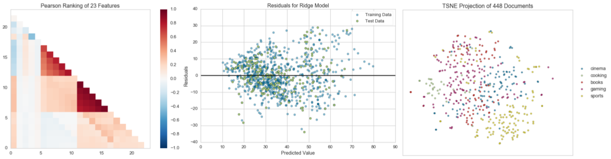

.. -*- mode: rst -*-
.. yellowbrick documentation master file, created by
    sphinx-quickstart on Tue Jul  5 19:45:43 2016.
    You can adapt this file completely to your liking, but it should at least
    contain the root `toctree` directive.

Yellowbrick: Machine Learning Visualization
===========================================

欢迎来到Yellowbrick！

我们最近正在将文档翻译成中文中，请稍后再来。

并且，我们总是在寻求帮助。如果你愿意帮助我们翻译，请向 `yellowbrick-docs-zh <https://github.com/DistrictDataLabs/yellowbrick-docs-zh>`_ 提交一个pull request。如果你对支持Yellowbrick感兴趣，请向 `codebase <https://github.com/DistrictDataLabs/yellowbrick>`_ 提交一个pull request。

Yellowbrick是由一套被称为"Visualizers"组成的可视化诊断工具组成的套餐，其由Scikit-Learn API延伸而来，对模型选择过程其指导作用。总之，Yellowbrick结合了Scikit-Learn和Matplotlib并且最好得传承了Scikit-Learn文档，对 *你的* 模型进行可视化！想要更多地了解Yellowbrick，请访问 :doc:`about` 。

如果你第一次接触Yellowbrick，请查看 :doc:`quickstart` 或者直接跳到 :doc:`tutorial` 。Yellowbrick是一个丰富的库，并且定期加入多个Visualizers。想要对了解特定Visualizers的更多细节并且扩展对其使用，请前往 :doc:`api/index` 。如果你想对Yellowbrick作出贡献，请查看 :ref:`contributing guide <contributing>` 。如果你已经报名参加用户测试，请前往 :doc:`evaluation` （谢谢！）。

Visualizers
-----------

Visualizers也是estimators（从数据中习得的对象），其主要任务是产生可对模型选择过程有更深入了解的视图。从Scikit-Learn来看，当可视化数据空间或者封装一个模型estimator时，其和转换器（transformers）相似，就像"ModelCV" (比如 `RidgeCV <http://scikit-learn.org/stable/modules/generated/sklearn.linear_model.RidgeCV.html>`_, `LassoCV <http://scikit-learn.org/stable/modules/generated/sklearn.linear_model.LassoCV.html>`_ )的工作原理一样。Yellowbrick的主要目标是创建一个和Scikit-Learn类似的有意义的API。其中最受欢迎的visualizers包括：

特征可视化
~~~~~~~~~~~~~~~~~~~~~

- :doc:`api/features/rankd`: 对单个或者两两对应的特征进行排序以检测其相关性
- :doc:`api/features/pcoords`: 对实例进行水平视图
- :doc:`Radial Visualization <api/features/radviz>`: 在一个圆形视图中将实例分隔开
- :doc:`api/features/pca`: 通过主成分将实例投射
- :doc:`api/features/importances`: 基于它们在模型中的表现对特征进行排序
- :doc:`Scatter and Joint Plots<api/features/scatter>`: 用选择的特征对其进行可视化

分类可视化
~~~~~~~~~~~~~~~~~~~~~~~~~~~~

- :doc:`api/classifier/class_balance`: 看类的分布怎样影响模型
- :doc:`api/classifier/classification_report`: 用视图的方式呈现精确率，召回率和F1值
- :doc:`ROC/AUC Curves <api/classifier/rocauc>`: 特征曲线和ROC曲线子下的面积
- :doc:`Confusion Matrices <api/classifier/confusion_matrix>`: 对分类决定进行视图描述

回归可视化
~~~~~~~~~~~~~~~~~~~~~~~~

- :doc:`api/regressor/peplot`: 沿着目标区域对模型进行细分
- :doc:`api/regressor/residuals`: 显示训练数据和测试数据中残差的差异
- :doc:`api/regressor/alphas`: 显示不同alpha值选择对正则化的影响

聚类可视化
~~~~~~~~~~~~~~~~~~~~~~~~

- :doc:`K-Elbow Plot <api/cluster/elbow>`: 用肘部法则或者其他指标选择k值
- :doc:`Silhouette Plot <api/cluster/silhouette>`: 通过对轮廓系数值进行视图来选择k值

文本可视化
~~~~~~~~~~~~~~~~~~

- :doc:`Term Frequency <api/text/freqdist>`: 对词项在语料库中的分布频率进行可视化
- :doc:`api/text/tsne`: 用随机邻域嵌入来投射文档

... 以及更多！Visualizers随时在增加中，请务必查看示例（甚至是 `develop branch <https://github.com/DistrictDataLabs/yellowbrick/tree/develop>`_ 上的），并且随时欢迎你对Visualizers贡献自己的想法。

获取帮助
------------

Yellowbrick是一个传承自Matplotlib和Scikit-Learn的热情包容的项目。和这些项目一样，我们遵守 `Python Software Foundation Code of Conduct <http://www.python.org/psf/codeofconduct/>`_ 。如果需要帮助、或者想要对项目进行贡献、或者发现有漏洞需要报告，请不要犹豫，随时和我们联系。

寻求帮助最主要的方法是在我们的 `Google Groups Listserv <https://groups.google.com/forum/#!forum/yellowbrick>`_ 上发帖。这是社区会员可以加入以及互相回应的一个邮件列表/论坛；在这里你应该能得到最快的回应。希望你也能考虑加入这个组，这样你也可以回答问题！你也可以在 `Stack Overflow <http://stackoverflow.com/questions/tagged/yellowbrick>`_ and tag them with "yellowbrick". Or you can add issues on GitHub. You can also tweet or direct message us on Twitter `@DistrictDataLab <https://twitter.com/districtdatalab>`_ 上问问题。

开源
-----------

Yellowbrick `license <https://github.com/DistrictDataLabs/yellowbrick/blob/master/LICENSE.txt>`_ 使用开源 `Apache 2.0 <http://www.apache.org/licenses/LICENSE-2.0>`_ 许可证。 Yellowbrickx拥有一个非常活跃的开发者社区；请考虑加入他们并且 `贡献 <https://github.com/DistrictDataLabs/yellowbrick/blob/develop/CONTRIBUTING.md>`_ ！

Yellowbrick在 `GitHub <https://github.com/DistrictDataLabs/yellowbrick/>`_ 上托管。`issues <https://github.com/DistrictDataLabs/yellowbrick/issues/>`_ 和 `pull requests <https://github.com/DistrictDataLabs/yellowbrick/pulls>`_ 都记录在上面。

目录
-----------------

这个版本库的Yellowbrick文档的完整清单如下：

.. toctree::
   :maxdepth: 2

   quickstart
   tutorial
   api/index
   evaluation
   contributing
   matplotlib
   about
   changelog

索引和表格
------------------

* :ref:`genindex`
* :ref:`modindex`

翻译：`Juan L. Kehoe <https://juan0001.github.io/>`_
