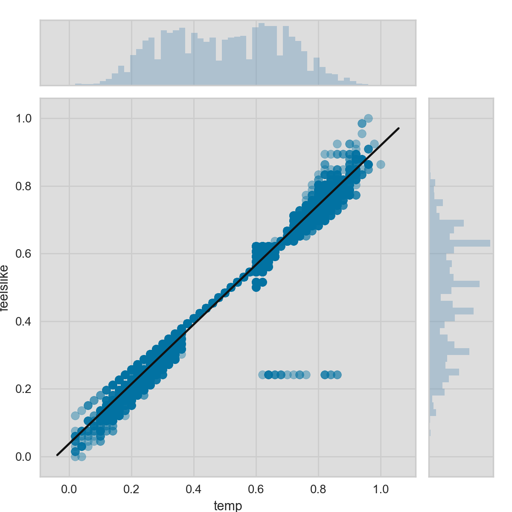

.. -*- mode: rst -*-

快速开始
===========

如果你对Yellowbrick还不熟悉, 这个教程可以帮助你很快上手将可视化运用到你机器学习的流程中去。不过在我们开始用Yellowbrick之前，有几个开发环境相关的问题需要注意。

Yellowbrick主要依赖于两个包: `Scikit-Learn <http://scikit-learn.org/>`_ 和 `Matplotlib <http://matplotlib.org/>`_.如果你没有安装这两个包也没关系，当你安装Yellowbrick的时候，它会帮你将它们一起装上。需要注意的是，要想Yellowbrick达到最佳效果，最好是结合Scikit-Learn 0.18和Matplotlib 2.0及以上版本使用。因为上述两个包都通过C语言编译，在某些系统上（比如Windows）安装时可能会有一些困难。如果你安装有困难，可以使用 `Anaconda <https://anaconda.org>`_ 等其他版本Python。

.. 注意:: Jupyter，Pandas，还有其他辅助库，比如文字可视化库（NLTK）是没有和Yellowbrick一起安装的，必须单独安装.

安装
------------

Yellowbrick虽然和Python 2.7及以后版本也兼容，但是如果你想更好得利用其全部功能，建议其与和Python 3.5及以后版本一起使用。安装Yellowbrick最简单的方法是从PyPI_用pip_（Python包安装的首选安装程序）安装。
.. code-block:: bash

    $ pip install yellowbrick

.. _PyPI: https://pypi.python.org/pypi/yellowbrick
.. _pip: https://docs.python.org/3/installing/

需要注意的是Yellowbrick是一个在建的项目，目前常规发布新的版本，并且每一个新版本都将会有新的可视化功能更新。为了将Yellowbrick升级到最新版本，你可以用如下pip命令.

.. code-block:: bash

    $ pip install -u yellowbrick

你也可以用 ``-u`` 标记对Scikit-Learn，matplotlib或者其他和Yellowbrick兼容的第三方包进行升级.

如果你使用的是Windows或者Anaconda，你也可以充分利用
`conda <https://conda.io/docs/intro.html>`_ 的功能安装 `Anaconda Yellowbrick package <https://anaconda.org/DistrictDataLabs/yellowbrick>`_ :

.. code-block:: bash

    conda install -c districtdatalabs yellowbrick

.. 警告:: 在Linux上用Anaconda安装matplotlib时有一个 `漏洞 <https://github.com/DistrictDataLabs/yellowbrick/issues/205>`_ 。如果你有任何问题，请在GitHub知会我们.

一旦安装好，不管你是在Python内部还是在Jupyter notebooks上运行Yellowbrick应该就没问题了。需要注意的是，因为Yellowbrick用的是matplotlib，其并不能在虚拟环境中运行。如果你一定要用的话，可能需要费一些周折。

使用Yellowbrick
-----------------
为了更好得配合Scikit-Learn一起使用，我们特意对Yellowbrick API进行了一些特殊设计。当然其最主要的接口就是“Visualizer” —— 一个可以运用数据产生图片的对象。visualizer是一系列Scikit-Learn的 `Estimator <http://scikit-learn.org/stable/developers/contributing.html#apis-of-scikit-learn-objects>`_ 对象并且和画图的方法有很多接口。和用Scikit-Learn建模相同的流程相同，用visualizer也需要先将其载入，对其初始化，调用其``fit()``方法，然后调用其``poof()``方法 —— 然后就是见证奇迹的那一刻了。

比如，有很多visualizer可以作为转换器来使用，用于在模型拟合之前对特征进行分析。下面这个例子展示的就是如何用平行坐标的方法对高纬数据进行作图。

.. code-block:: python

    from yellowbrick.features import ParallelCoordinates

    visualizer = ParallelCoordinates()
    visualizer.fit_transform(X, y)
    visualizer.poof()

正如你所看到的一样，这个工作流程和用Scikit-Learn的转换器是一样的，并且visualizer的目的就是要和Scikit-Learn的应用程序相整合。和Scikit-Learn模型中的超参数一样，visualizer的参数也可以在其实例化同时就就传递进去，而这个参数可以决定画图的方式。

 ``poof()`` 方法用来完成最终的绘画（加标题，轴标签等等），然后根据你自己的要求对其进行渲染。如果你用的是Jupyter notebook的话，立刻就应该看到图。如果你运行的是Python脚本的话，图片将会在一个图形界面窗口以交互图片形式显示。当然，你也可以将图片传递到一个文件路径，将其保存在本地磁盘：

.. code-block:: python

    visualizer.poof(outpath="pcoords.png")

文件扩展名决定其不同的渲染方式。除了.png，.pdf扩展名也是常用的一种。

.. 注意::Yellowbrick的数据输入和Scikit-Learn的相同: 对一个数据即来说, ``X`` 表示一个形状为 ``(n,m)`` 的二维矩阵，其中 ``n`` 表示样本的大小（行），``m`` 表示特征的数量（列）。数据集 ``X`` 可以是Pandas中的DataFrame，也可以是Numpy中的array，或者是Python中的list。或者有监督学习中一个表示目标变量的向量 ``y`` ，也可以作为一个输入。目标变量 ``y`` 的长度必须为 ``n`` —— 和 ``X`` 中的行数（也即样本的数量）一样，可以是Pandas中的Series，Numpy中的array，或者Python中的list.

Visualizer还可封装Scikit-Learn模型然后对其进行评估，超参数调节和算法选择。比如，可以用heatmap方式对分类结果进行可视化，用来显示其精确度，召回率，F1值，并且对分类器中的所以类都支持。将estimator封装在visualizer的方法如下：

.. code-block:: python

    from yellowbrick.classifier import ClassificationReport
    from sklearn.linear_model import LogisticRegression

    model = LogisticRegression()
    visualizer = ClassificationReport(model)

    visualizer.fit(X_train, y_train)
    visualizer.score(X_test, y_test)
    visualizer.poof()

只需要在分类模型产生之后加入两行代码就可将模型评估可视化。首先实例化一个名为 ``ClassificationReport`` 的visualizer，并将分类estimator封装进去，然后调用其 ``poof()`` 方法。这样，Visualizers既*增强*了机器学习的工作流程又不对其进行干扰。

.. 需要做的:: 可视化流水线和文本分析的逐步解说。

基于分类的API是注定要直接和Scikit-Learn进行整合的。然而有时候你只需要一个快速视图的时候怎么半呢。Yellowbrick有一些功能可以支持快速视图。比如这两个诊断视图可以用如下方法实现：

.. code-block:: python

    from sklearn.linear_model import LogisticRegression

    from yellowbrick.features import parallel_coordinates
    from yellowbrick.classifier import classification_report

    # Displays parallel coordinates
    g = parallel_coordinates(X, y)

    # Displays classification report
    g = classification_report(LogisticRegression(), X, y)

这些快速视图的方法可能会有些减弱你对整个机器学习工作流程的控制，但是可以帮你很快得根据你的要求对模型进行诊断而且在数据探索过程中非常有效。

逐步解说
-----------

这里用一个回归分析作为简单的例子来展示怎样在机器学习流程中使用visualizers。用上传到 `UCI机器学习数据库 <https://archive.ics.uci.edu/ml/datasets/bike+sharing+dataset>`_ 的 `共享单车数据集 <https://s3.amazonaws.com/ddl-data-lake/yellowbrick/bikeshare.zip>`_ ，我们可以用季节、天气、或者是否假日等信息对某个小时内被租自行车的数量进行预测。

.. 注意:: 我们已经将UCI机器学习数据库中的这部分数据上传以便其更容易载入到Pandas中；确认你下载的是 `Yellowbrick版的数据集 <https://s3.amazonaws.com/ddl-data-lake/yellowbrick/bikeshare.zip>`_ 。

在你下载并且将数据集解压缩到你目前的工作目录之后，我们可以将数据用如下方法载入：

.. code-block:: python

    import pandas as pd

    data = pd.read_csv('bikeshare.csv')
    X = data[[
        "season", "month", "hour", "holiday", "weekday", "workingday",
        "weather", "temp", "feelslike", "humidity", "windspeed"
    ]]
    y = data["riders"]

机器学习的流程是创作*模型选择三重奏*的艺术，将特征、算法和超参数柔和在一起独特地组成一个模型并将其运用到特定的数据集上。作为特征选择的一部分，我们需要将和其他有线性关系的一部分特征识别出来。因为这部分特征有可能将协方差引入到模型中并且破坏OLS（将我们引入到移除特征或者使用正则化的道路上）。我们可以用Rank2D_ visualizer将所有特征两两之间的Pearson相关系数计算出来，具体操作如下：

.. _Rank2D: http://www.scikit-yb.org/en/latest/api/yellowbrick.features.html#module-yellowbrick.features.rankd

.. code-block:: python

   from yellowbrick.features import Rank2D

   visualizer = Rank2D(algorithm="pearson")
   visualizer.fit_transform(X)
   visualizer.poof()

.. image:: images/quickstart/bikeshare_rank2d.png

上图表示的是特征两辆之间Pearson相关系数，其中坐标中的每一个小格代表x和y轴上两个相交特征的相关系数，其颜色的深浅和相关系数的值大小相关。当Pearson系数为1.0时，表示两个特征之间有强烈的正的线性相关，而-1.0则表示两个特征之间有强烈的负的线性相关（而0则表示没有任何相关）。因此我们需要找到深红色或者深蓝色的方块对其进行深入研究。

在这个图上我们可以看到特征7（temperature）和特征9（feelslike）有很强的相关性，并且特征0（season）和特征1（month）也有很强的相关性。这好像有些道理；我们感觉的温度依赖于实际温度以及其他空气质量相关的因子，并且每年中的季节是通过月份来描述的。为了对其进行更深入的分析，我们还可以用 `JointPlotVisualizer <http://www.scikit-yb.org/en/latest/api/yellowbrick.features.html#module-yellowbrick.features.jointplot>`_ 来考察这些相关性。

.. code-block:: python

    from yellowbrick.features import JointPlotVisualizer

    visualizer = JointPlotVisualizer(feature='temp', target='feelslike')
    visualizer.fit(X['temp'], X['feelslike'])
    visualizer.poof()

上面用visualizer做了一个散点图，其中y轴是感觉的温度，x轴是实际温度，然后再将一个用简单线性回归训练的最佳模型的回归线添加上去。另外，还可将各个变量的分布情况用直方图的形式分别在x轴（temp）上方和y轴（feelslike）右侧显示。``JointPlotVisualizer`` 让我们能快速浏览有强相关性的特征，以及各个特征的范围和分布情况。需要注意的是图中的各个轴都已经标准话到0到1之间的值，这是机器学习中一中非常常用的减少一个特征对另一个影响的技术。

这个图非常有趣；首先在feelslike等于0.25处好像有一些异常值。为了增加最终模型的质量，也许需要我们对其进行人工移除,因为这些也许是数据输入造成错误。其次，我们可以看到更多的极端温度可以对感知温度造成夸大的效应；温度越低，人们就越容易感觉越冷，温度越高，人们就感觉天气越暖和。适中的温度则让人感觉起来和实际温度不相上下。这给我们一个直觉好像feelslike是一个比temp更好的特征，并且如果其对我们的回归分析造成问题的话，我们应该移除temp变量而保留feelslike。

到这，我们就可以训练我们模型了；我们来训练一个线性回归模型，并且绘制其残差。

.. code-block:: python

    from yellowbrick.regressor import ResidualsPlot
    from sklearn.linear_model import LinearRegression
    from sklearn.model_selection import train_test_split

    # Create training and test sets
    X_train, X_test, y_train, y_test = train_test_split(
        X, y, test_size=0.1
    )

    visualizer = ResidualsPlot(LinearRegression())
    visualizer.fit(X_train, y_train)
    visualizer.score(X_test, y_test)
    visualizer.poof()

.. image:: images/quickstart/bikeshare_ols_residuals.png

残差图不但可以显示与预测数据对应的误差，并且可以让我们观察到模型中的异方差性；比如，方差最大的区域。残差的形状可以让我们很好得意识模型中的组成部分对OLS（普通最小二乘法）的影响最大区域。在这种情况下，我们可以看到预测的值越小（骑车人数越小），误差就越小，而预测的骑车人数越大，误差就越大。这就意味着我们的模型在某些目标区域有更多的噪音或者那两个变量是共线性的，也就是说在他们关系中的噪音发生变化时就产生了误差。

残差图还向我们展示了模型的误差是怎么产生的：那根加粗的水平线表示的是 ``residuals = 0`` ，也就是没有误差；线上方或者下方的点则表示误差值的大小。比如大部分残差是负值，并且其值是由 ``actual - expected`` 算得，也就是说大部分时间预测值比实际值要大，比如和实际相比我们的模型总是预测有更多的骑手。还有，在残差图的右上角还有一个非常有趣的分界线，显示模型空间中有一种非常有趣的效应；也许在这个模型中有一些特征权重比较大。

最后，残差图中的训练样本和测试样本还可以用不同的颜色标注。这可以帮助我们更好的发现在训练和测试样本生成时产生的误差。如果测试样本误差和训练样本误差不相符的话，那我们的样本不是过拟合就是欠拟合。否则就是产生两个样本前随机整理数据集时产生了误差。

因为这个模型的决定系数为0.328，让我们看看能不能用*正则化*训练一个更好的模型，并同时探索另一个visualizer。

.. code-block:: python

    import numpy as np

    from sklearn.linear_model import RidgeCV
    from yellowbrick.regressor import AlphaSelection

    alphas = np.logspace(-10, 1, 200)
    visualizer = AlphaSelection(RidgeCV(alphas=alphas))
    visualizer.fit(X, y)
    visualizer.poof()

在探索模型家族的过程中，第一个要考虑的是模型是怎样变得更*复杂*的。当模型的复杂度增加，由于方差增加形成的误差也相应增加，因为模型会变得过拟合并且不能泛化到未知数据上。然而，模型越简单由于偏差造成的误差就会越大；模型欠拟合，因此有更多的未中靶预测。大部分机器学习的目的就是要产生一个*复杂度适中*的模型，在偏差和方差之间找到一个中间点。

对一个线性模型来说，复杂度来自于特征本身以及根据模型赋予它们的值。因此对线性模型期望用*最少的特征*达到最好的阐释结果。*正则化*是实现如上目标的其中一种技术，即引入一个alpha参数来对其相互之间系数的权重进行标准化并且惩罚其复杂度。Alpha和复杂度之间是一个负相关。alpha值越大，复杂度越小，反之亦然。

因此现在的问题就变成怎样选取alpha值了。其中的一项技术是用交叉验证的方法训练一系列模型，然后选择使误差值最小的alpha。 ``AlphaSelection`` 就是实现以上技术的一个visualizer，其以图表形式呈现正则化的效果。正如上图所示，误差随着alpha值的增加而减小直到我们需要的值（目前情况下为3.181），然后误差开始增加。这让我们可以实现偏差/方差平衡的目标，并且可以对不同的正则化方法之间的关系进行探索（比如Ridge对阵Lasso）。

我们现在可以训练我们最终的模型并且用 ``PredictionError`` 对其进行可视化了：

.. code-block:: python

    from sklearn.linear_model import Ridge
    from yellowbrick.regressor import PredictionError

    visualizer = PredictionError(Ridge(alpha=3.181))
    visualizer.fit(X_train, y_train)
    visualizer.score(X_test, y_test)
    visualizer.poof()

.. image:: images/quickstart/bikeshare_ridge_prediction_error.png
用预测误差visualizer将实际（测量）值对期望（预测）值进行可视化。黑色的45度虚线表示误差为0的点。和残差图一样，这让我们可以看到误差在何处出现，值为多大。

在这个图上，我们可以看到大部分的点集中在小于200骑手的位置。我们也许想要尝试用正交匹配追踪算法（OMP）或者样条（spline）来训练一个将更多区域性考虑进来的回归模型。我们还可以看到残差图中奇怪的拓扑结构好像已被Ridge回归纠正，而且在我们的模型中大值和小值之间有了更多的平衡。Ridge正则化可能纠正了两个特征之间的协方差问题。当我们用其他模型的形式将我们的数据分析推进的同时，我们可以继续visualizers来快速比较并且可视化我们的结果。

希望这个流程让你对怎样将Visualizers通过Scikit-Learn整合到机器学习中去有一个概念，并且给你启发让你将其运用到你的工作中！如果想要了解更多的有关怎样开始使用Yellowbrick的信息，请查看 :doc:`tutorial` 。然后你就在 :doc:`api/index` 上快速查看更多的特定visualizers了。

翻译：`Juan L. Kehoe <https://juan0001.github.io/>`_
