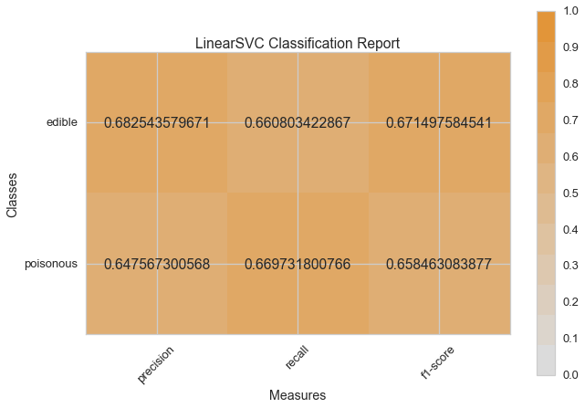
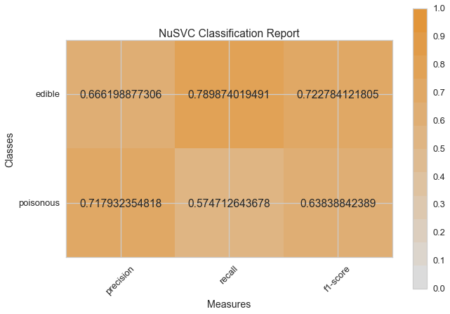
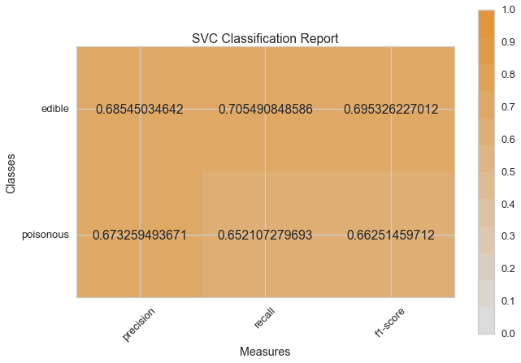
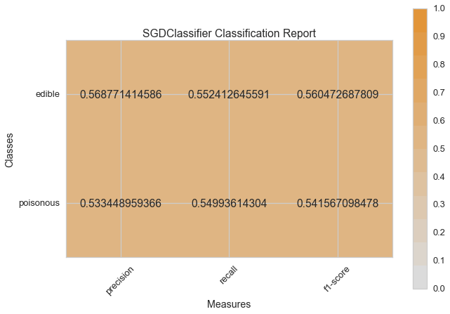
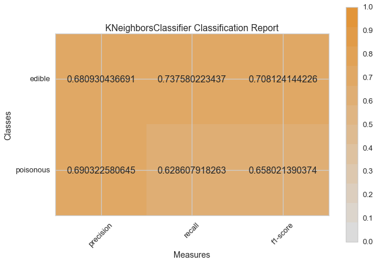
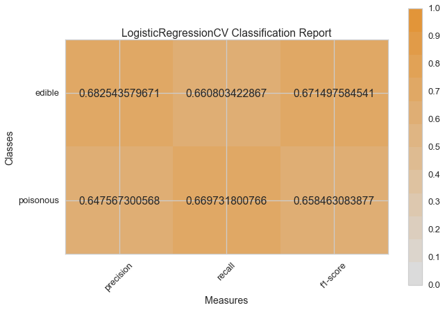
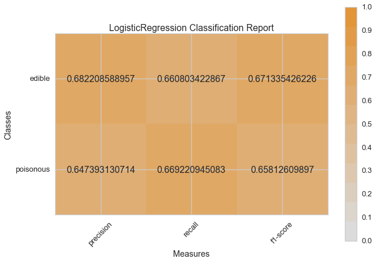
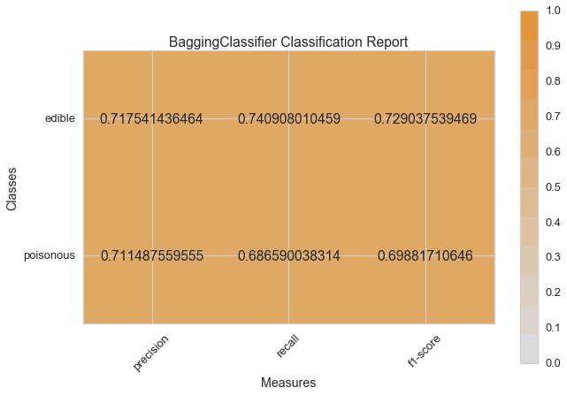
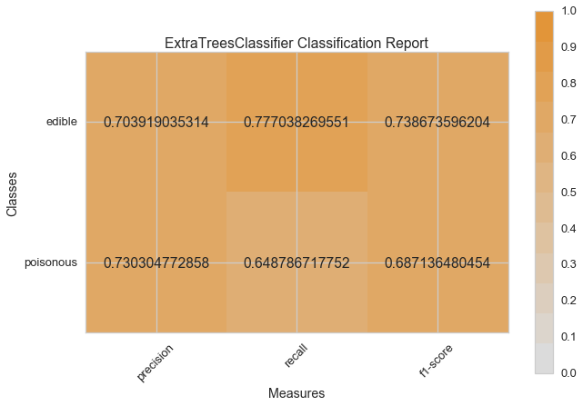
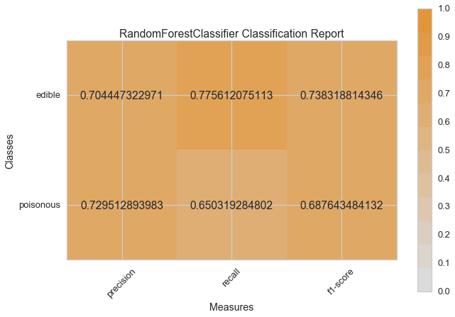

.. -*- mode: rst -*-

模型选择教程
========================

在本教程中，我们将查看各种 `Scikit-Learn <http://scikit-learn.org>`__ 模型的分数，并使用 `Yellowbrick <http://www.scikit-yb.org>`__ 的可视化诊断工具对其进行比较，以便为我们的数据选择最佳模型。

模型选择三元组
--------------------------
关于机器学习的讨论常常集中在模型选择上。无论是逻辑回归、随机森林、贝叶斯方法，还是人工神经网络，机器学习实践者通常都能很快地展示他们的偏好。这主要是因为历史原因。尽管现代的第三方机器学习库使得各类模型的部署显得微不足道，但传统上，即使是其中一种算法的应用和调优也需要多年的研究。因此，与其他模型相比，机器学习实践者往往对特定的(并且更可能是熟悉的)模型有强烈的偏好。

然而，模型选择比简单地选择“正确”或“错误”算法更加微妙。实践中的工作流程包括:

1. 选择和/或设计最小和最具预测性的特性集
2. 从模型家族中选择一组算法，并且
3. 优化算法超参数以优化性能。

**模型选择三元组** 是由Kumar 等人，在 2015 年的 SIGMOD_ 论文中首次提出。在他们的论文中，谈论到下一代为预测建模而构建的数据库系统的开发。作者很中肯地表示，由于机器学习在实践中具有高度实验性，因此迫切需要这样的系统。“模型选择，”他们解释道，“是迭代的和探索性的，因为(模型选择三元组)的空间通常是无限的，而且通常不可能让分析师事先知道哪个(组合)将产生令人满意的准确性和/或洞察力。”

最近，许多工作流程已经通过网格搜索方法、标准化 API 和基于 GUI 的应用程序实现了自动化。然而，在实践中，人类的直觉和指导可以比穷举搜索更有效地专注于模型质量。通过可视化模型选择过程，数据科学家可以转向最终的、可解释的模型，并避免陷阱和陷阱。

Yellowbrick 库是一个针对机器学习的可视化诊断平台，它允许数据科学家控制模型选择过程。Yellowbrick 用一个新的核心对象扩展了Scikit-Learn 的 API: Visualizer。Visualizers 允许可视化模型作为Scikit-Learn管道过程的一部分进行匹配和转换，从而在高维数据的转换过程中提供可视化诊断。

.. _SIGMOD: http://cseweb.ucsd.edu/~arunkk/vision/SIGMODRecord15.pdf

关于数据
--------------
本教程使用来自 `UCI Machine Learning Repository <http://archive.ics.uci.edu/ml/>`__ 的修改过的蘑菇数据集版本。我们的目标是基于蘑菇的特定，去预测蘑菇是有毒的还是可食用的。

.. _dataset: https://github.com/rebeccabilbro/rebeccabilbro.github.io/blob/master/data/agaricus-lepiota.txt

这些数据包括与伞菌目(Agaricus)和环柄菇属(Lepiota)科中23种烤蘑菇对应的假设样本描述。
每一种都被确定为绝对可食用，绝对有毒，或未知的可食用性和不推荐（后一类与有毒物种相结合）。

我们的文件“agaricus-lepiota.txt”，包含3个名义上有价值的属性信息和8124个蘑菇实例的目标值(4208个可食用，3916个有毒)。

让我们用Pandas加载数据。

.. code:: python

    import os
    import pandas as pd

    names = [
        'class',
        'cap-shape',
        'cap-surface',
        'cap-color'
    ]

    mushrooms = os.path.join('data','agaricus-lepiota.txt')
    dataset   = pd.read_csv(mushrooms)
    dataset.columns = names
    dataset.head()

= =========  =========  ===========  =========
. class      cap-shape  cap-surface  cap-color
= =========  =========  ===========  =========
0 edible     bell       smooth       white
1 poisonous  convex     scaly        white
2 edible     convex     smooth       gray
3 edible     convex     scaly        yellow
4 edible     bell       smooth       white
= =========  =========  ===========  =========

.. code:: python

    features = ['cap-shape', 'cap-surface', 'cap-color']
    target   = ['class']

    X = dataset[features]
    y = dataset[target]

特征提取
------------------

我们的数据，包括目标参数，都是分类型数据。为了使用机器学习，我们需要将这些值转化为数值型数据。为了从数据集中提取这一点，我们必须使用Scikit-Learn的转换器（transformers）将输入数据集转换为适合模型的数据集。幸运的是，Sckit-Learn提供了一个转换器，用于将分类标签转换为整数: `sklearn.preprocessing.LabelEncoder <http://scikit-learn.org/stable/modules/generated/sklearn.preprocessing.LabelEncoder.html>`__。不幸的是，它一次只能转换一个向量，所以我们必须对它进行调整，以便将它应用于多个列。

.. code:: python

    from sklearn.base import BaseEstimator, TransformerMixin
    from sklearn.preprocessing import LabelEncoder, OneHotEncoder

    class EncodeCategorical(BaseEstimator, TransformerMixin):
        """
        Encodes a specified list of columns or all columns if None.
        """

        def __init__(self, columns=None):
            self.columns  = [col for col in columns]
            self.encoders = None

        def fit(self, data, target=None):
            """
            Expects a data frame with named columns to encode.
            """
            # Encode all columns if columns is None
            if self.columns is None:
                self.columns = data.columns

            # Fit a label encoder for each column in the data frame
            self.encoders = {
                column: LabelEncoder().fit(data[column])
                for column in self.columns
            }
            return self

        def transform(self, data):
            """
            Uses the encoders to transform a data frame.
            """
            output = data.copy()
            for column, encoder in self.encoders.items():
                output[column] = encoder.transform(data[column])

            return output

建模与评估
-----------------------

评估分类器的常用指标
~~~~~~~~~~~~~~~~~~~~~~~~~~~~~~~~~~~~~~~~~

**精确度(Precision)** 是正确的阳性结果的数量除以所有阳性结果的数量(例如，我们预测的可食用蘑菇实际上有多少?)

**召回率(Recall)** 是正确的阳性结果的数量除以应该返回的阳性结果的数量(例如，我们准确预测了多少有毒蘑菇是有毒的?)

**F1分数(F1 score)** 是测试准确度的一种衡量标准。它同时考虑测试的精确度和召回率来计算分数。F1得分可以解释为精度和召回率的加权平均值，其中F1得分在1处达到最佳值，在0处达到最差值。

::

    precision = true positives / (true positives + false positives)

    recall = true positives / (false negatives + true positives)

    F1 score = 2 * ((precision * recall) / (precision + recall))

现在我们准备好作出一些预测了！

让我们构建一种评估多个估算器(multiple estimators)的方法 —— 首先使用传统的数值分数（我们稍后将与Yellowbrick库中的一些可视化诊断进行比较）。

.. code:: python

    from sklearn.metrics import f1_score
    from sklearn.pipeline import Pipeline

    def model_selection(X, y, estimator):
        """
        Test various estimators.
        """
        y = LabelEncoder().fit_transform(y.values.ravel())
        model = Pipeline([
             ('label_encoding', EncodeCategorical(X.keys())),
             ('one_hot_encoder', OneHotEncoder()),
             ('estimator', estimator)
        ])

        # Instantiate the classification model and visualizer
        model.fit(X, y)

        expected  = y
        predicted = model.predict(X)

        # Compute and return the F1 score (the harmonic mean of precision and recall)
        return (f1_score(expected, predicted))

.. code:: python

    # Try them all!
    from sklearn.svm import LinearSVC, NuSVC, SVC
    from sklearn.neighbors import KNeighborsClassifier
    from sklearn.linear_model import LogisticRegressionCV, LogisticRegression, SGDClassifier
    from sklearn.ensemble import BaggingClassifier, ExtraTreesClassifier, RandomForestClassifier

.. code:: python

    model_selection(X, y, LinearSVC())

.. parsed-literal::

    0.65846308387744845

.. code:: python

    model_selection(X, y, NuSVC())

.. parsed-literal::

    0.63838842388991346

.. code:: python

    model_selection(X, y, SVC())

.. parsed-literal::

    0.66251459711950167

.. code:: python

    model_selection(X, y, SGDClassifier())

.. parsed-literal::

    0.69944182052382997

.. code:: python

    model_selection(X, y, KNeighborsClassifier())

.. parsed-literal::

    0.65802139037433149

.. code:: python

    model_selection(X, y, LogisticRegressionCV())

.. parsed-literal::

    0.65846308387744845

.. code:: python

    model_selection(X, y, LogisticRegression())

.. parsed-literal::

    0.65812609897010799

.. code:: python

    model_selection(X, y, BaggingClassifier())

.. parsed-literal::

    0.687643484132343

.. code:: python

    model_selection(X, y, ExtraTreesClassifier())

.. parsed-literal::

    0.68713648045448383

.. code:: python

    model_selection(X, y, RandomForestClassifier())

.. parsed-literal::

    0.69317131158367451

初步模型评估
~~~~~~~~~~~~~~~~~~~~~~~~~~~~

根据上面F1分数的结果，哪个模型表现最好？

可视化模型评估
-----------------------

现在，让我们重构模型评估函数，使用Yellowbrick的ClassificationReport类，这是一个模型可视化工具，可以显示精确度、召回率和F1分数。这个可视化的模型分析工具集成了数值分数以及彩色编码的热力图，以支持简单的解释和检测，特别是对于我们用例而言非常相关(性命攸关!)的第一类错误(Type I error)和第二类错误(Type II error)的细微差别。

**第一类错误** (或 **"假阳性(false positive)"** ) 是检测一种不存在的效应(例如，当蘑菇实际上是可以食用的时候，它是有毒的)。

**第二类错误** (或 **“假阴性”"false negative"** ) 是未能检测到存在的效应(例如，当蘑菇实际上有毒时，却认为它是可以食用的)。

.. code:: python

    from sklearn.pipeline import Pipeline
    from yellowbrick.classifier import ClassificationReport

    def visual_model_selection(X, y, estimator):
        """
        Test various estimators.
        """
        y = LabelEncoder().fit_transform(y.values.ravel())
        model = Pipeline([
             ('label_encoding', EncodeCategorical(X.keys())),
             ('one_hot_encoder', OneHotEncoder()),
             ('estimator', estimator)
        ])

        # Instantiate the classification model and visualizer
        visualizer = ClassificationReport(model, classes=['edible', 'poisonous'])
        visualizer.fit(X, y)
        visualizer.score(X, y)
        visualizer.poof()

.. code:: python

    visual_model_selection(X, y, LinearSVC())

.. code:: python

    visual_model_selection(X, y, NuSVC())

.. code:: python

    visual_model_selection(X, y, SVC())

.. code:: python

    visual_model_selection(X, y, SGDClassifier())

.. code:: python

    visual_model_selection(X, y, KNeighborsClassifier())

.. code:: python

    visual_model_selection(X, y, LogisticRegressionCV())

.. code:: python

    visual_model_selection(X, y, LogisticRegression())

.. code:: python

    visual_model_selection(X, y, BaggingClassifier())

.. code:: python

    visual_model_selection(X, y, ExtraTreesClassifier())

.. code:: python

    visual_model_selection(X, y, RandomForestClassifier())

检验
----------
1. 现在,哪种模型看起来最好?为什么?
2. 哪一个模型最有可能救你的命?
3. 可视化模型评估与数值模型评价，体验起来有何不同?
